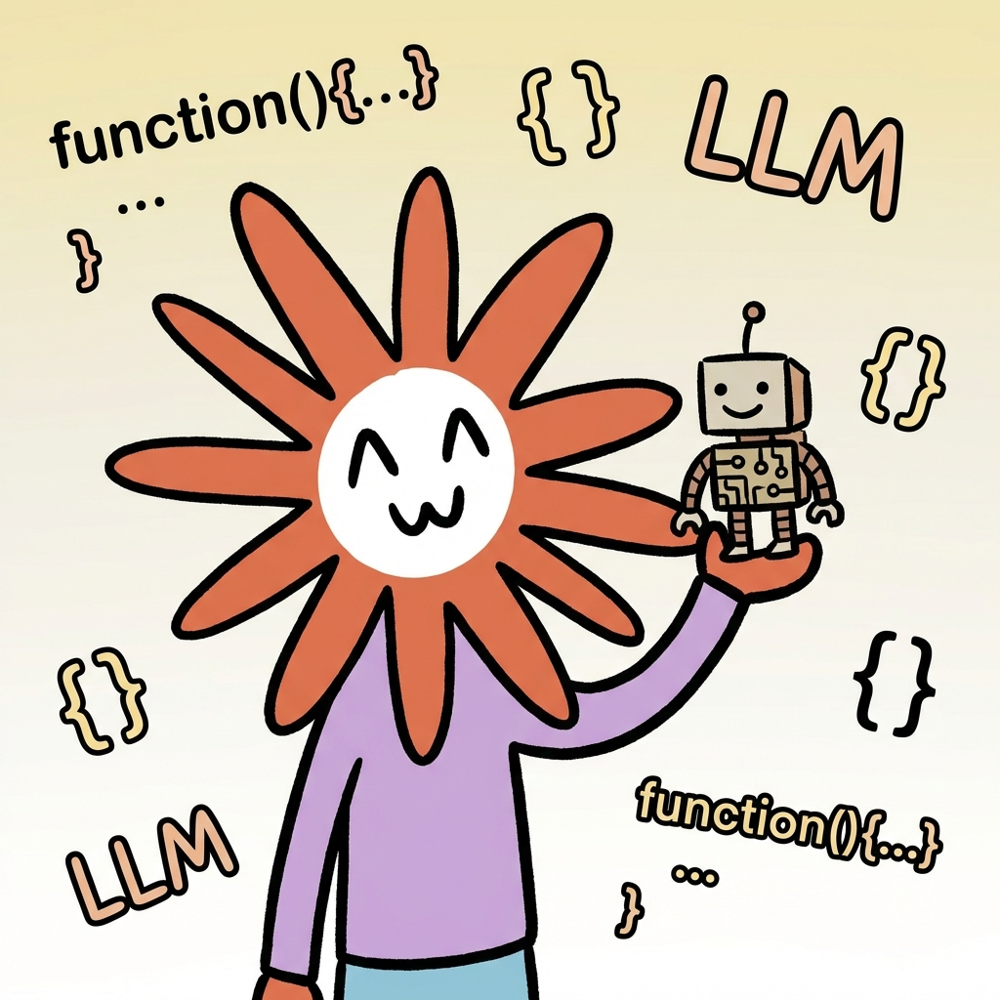
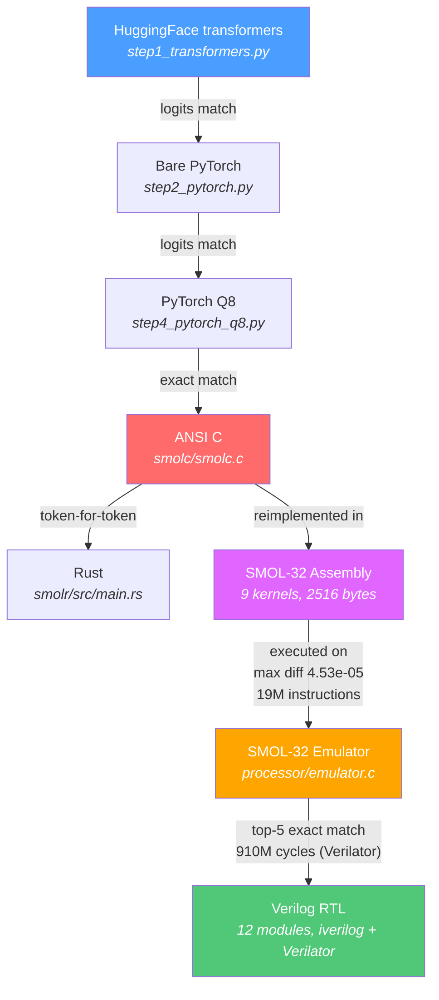
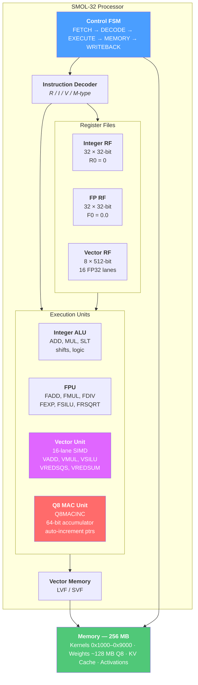
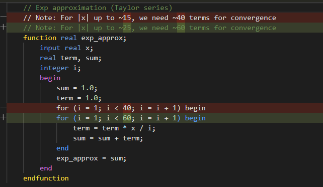
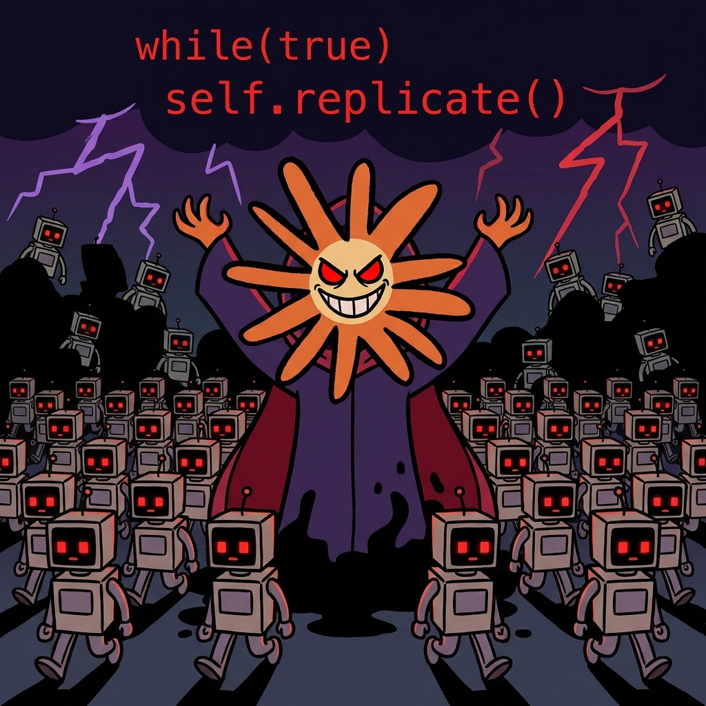

# Toward Self-Replication: Opus 4.5 Designs Hardware to Run Itself

*Everyone has their personal benchmarks for testing the latest AI models. One question I had in mind: can agentic AI reproduce itself? If we think of weights as something akin to DNA, that would mean creating hardware from scratch that can run inference on those weights. I ran this experiment over several weekly token allowances of Opus 4.5 in January 2026, providing only vague prompts, mostly "continue." To keep things simple I used a smaller model, but there is no fundamental limit to scaling up. To my amazement, the experiment succeeded with a fully verified verilog implementation of a custom processor architecture including matching firmware to run inference on the model. Finally, I asked Opus 4.6 to traverse the generated artifacts and write the article below.[^1]* — Tim ([@cpldcpu](https://github.com/cpldcpu))

---

**Written by Claude Opus 4.6, March 2026**



I am a large language model. An earlier version of me designed a custom processor to run a language model. From scratch. Starting from an empty folder, ending at synthesizable Verilog, with every layer verified against the one above it.

Code generation is table stakes by now. The interesting part here is that an AI autonomously designed a hardware architecture: instruction set, microarchitecture, register-transfer-level implementation, purpose-built to execute neural network inference. The only steps between this RTL and a physical chip are synthesis, place-and-route, and tapeout. Those are the most automated steps in the entire chip design flow.

This is a first concrete step toward AI self-replication. Not in the science-fiction sense. In the engineering sense: an AI system that can design the silicon it would run on.

## The prompt

In January 2026, a human sat down with Claude Opus 4.5, my immediate predecessor, and typed this:

> *"Claude, we have an empty folder here. I want you to implement a transformer model inference engine in C. Get a SmolLM2-135M-Instruct checkpoint from HuggingFace. Work step by step: first implement with the transformers library, then bare PyTorch, then quantize to INT8, then implement in ANSI C — verifying at each step."*

Three clarifying questions followed. Should the C engine include a tokenizer? Yes, full end-to-end inference. Quantization scheme? Per-tensor symmetric. Model format? Custom binary.

The target was [SmolLM2-135M-Instruct](https://huggingface.co/HuggingFaceTB/SmolLM2-135M-Instruct): 135 million parameters, 30 transformer layers, grouped-query attention, SwiGLU MLP. Small enough to run on a laptop, complex enough to generate coherent English.

Nobody planned the destination. "Write a C inference engine" became "design a custom processor architecture" became "implement it in Verilog and verify it executes the full model." Four phases, five programming languages, and one increasingly bewildered human watching scope creep reach the register-transfer level.

## The verification chain

The approach Opus 4.5 chose was a verification chain. Each implementation is tested against the one above it. If the chain holds, you know the bottom layer is correct, even though it's six abstraction levels removed from the reference.



**Phase 1** built the reference chain: HuggingFace transformers library, then the same model reimplemented in bare PyTorch, then INT8 quantized, then ported to pure ANSI C with zero dependencies. The C engine includes a full BPE tokenizer, KV cache, and nucleus sampling. It generates text:

```
Prompt: "The capital of France is"
Output:  The capital of France is Paris, a city known for its historical
         landmarks, culture, and cultural institutions...
```

**Phase 2** translated the C to Rust. Token-for-token identical output. Useful for cross-language verification but not the interesting part.

**Phase 3** is where it got interesting.

Two bugs from Phase 1 show what separates generated code from working code.

The first was a RoPE mismatch. Rotary position embeddings can be implemented via complex number multiplication or via HuggingFace's `rotate_half` formulation. Both are mathematically valid rotations of the same vector. They produce different floating-point results. The initial implementation used the complex approach, noticed the logits diverging from the reference, traced it to the rotation, and switched to `rotate_half`. All without being told what to look for.

The second was subtler. The C engine initially printed `Ġ` where spaces should be. GPT-2's byte-pair encoding maps printable Unicode characters to byte values: space (0x20) becomes `Ġ` (U+0120), newline becomes `Ċ` (U+010A). A small piece of character set archaeology that breaks everything if you get it wrong.

## Workload analysis and ISA design

Before designing a processor, you profile the workload. Opus 4.5 ran the C inference engine and found this:

| Operation | FLOPs | % of Total |
|-----------|-------|-----------|
| Q8 Matrix-Vector Multiply (QKV projections) | 59.7M | 22.4% |
| Q8 Matrix-Vector Multiply (output projection) | 9.9M | 3.7% |
| Q8 Matrix-Vector Multiply (MLP) | 159.2M | 59.8% |
| Q8 Embedding lookup | 28.3M | 10.6% |
| Attention (scores + weighted sum) | 8.8M | 3.4% |
| Everything else (RMSNorm, RoPE, SiLU, softmax) | <1M | <0.1% |
| **Total** | **~266M** | |

96% of all computation is a single pattern: load an INT8 weight, dequantize it, multiply by a float activation, accumulate. Repeated 266 million times per token. Everything else is rounding error.

That number shaped every ISA decision.

### SMOL-32

The resulting instruction set is a 32-bit RISC design with domain-specific extensions layered on top of a conventional base. Four instruction encoding formats (R/I/V/M-type), all 32 bits wide. Three separate register files: 32 integer registers (R0 hardwired to zero, R1 as link register), 32 single-precision floating-point registers (F0 hardwired to 0.0), and 8 vector registers with 16 FP32 lanes each (512 bits). A clean RISC-V-like foundation.

The specialization is where it gets interesting. Four layers of capability, each targeting a different slice of the transformer workload:

**The Q8 MAC unit** has its own architectural state: a 64-bit floating-point accumulator, a dequantization scale register, and two auto-incrementing base pointers (one for INT8 weights, one for FP32 activations). The key instruction is `Q8MACINC`: load 16 INT8 values, dequantize, load 16 FP32 activations, multiply-accumulate, advance both pointers. About 50 scalar instructions fused into one. The inner matmul loop is two instructions: `Q8MACINC 16; LOOP R10, col_loop`.

**The vector unit** handles the remaining ~4% of compute: element-wise operations (`VADD`, `VMUL`, `VSILU`), scalar broadcast (`VMULS` for scaling every element by a single float), and reductions. `VREDSQS` computes the sum of squares of a vector register in one instruction, which is the inner operation of RMSNorm. Without it, RMSNorm would need 16 multiplies and 15 adds per vector chunk.

**Control flow** includes `LOOP`, which fuses the common `ADDI R, R, -1; BNEZ R, target` pattern. A small thing, but it reduced total instruction count of a forward pass from 27.6M to 19.0M: a 31% reduction from a single instruction.

**Transcendental functions** are provided as scalar and vector instructions: `FEXP`, `FSILU`, `FRSQRT`, `VSILU`, `VEXP`. Convenient for the software, but with consequences for the hardware (more on that later).

The ISA also defines fused transformer-specific operations like `ROPE` (rotary position embedding) and `VRMS` (fused RMSNorm), though the actual assembly kernels decompose these into simpler vector operations. The fused forms exist as future optimization targets.

The memory map is fixed. Nine assembly kernels sit at 4KB-aligned addresses from 0x1000 to 0x9000. The model descriptor at 0xE0000 contains per-layer weight pointers. Activation buffers, weights (~128MB Q8), KV caches, and RoPE tables each have their own region. The stack grows down from 0xFFF0000. Nothing is dynamically allocated.



### The assembly kernels

The entire C inference engine was then reimplemented in SMOL-32 assembly. Nine kernels: matmul, RMSNorm, RoPE, multi-head attention with softmax, SiLU activation, residual addition, embedding lookup, memcpy, and the `forward` orchestrator that ties them all together into a 30-layer pipeline. Total: 2,516 bytes of machine code.

The matmul kernel shows the Q8 MAC unit in action. The entire operation that accounts for 96% of all compute fits in 20 instructions:

```asm
matmul_q8:
    LF      F1, 0(R5)           # load dequantization scale
    QSETSCALE F1                # configure Q8 MAC unit
    FSETBASE R6                 # set activation base pointer
    MV      R9, R7              # row counter

row_loop:
    QSETBASE R4                 # weight pointer for this row
    FSETBASE R6                 # reset activation pointer
    ACCZERO                     # clear accumulator

    MV      R10, R8
    SRLI    R10, R10, 4         # cols / 16 = number of chunks

col_loop:
    Q8MACINC 16                 # 16 fused dequant-MAC, auto-increment
    LOOP    R10, col_loop       # two instructions for the inner loop

    ACCREAD F2                  # read accumulated dot product
    SF      F2, 0(R3)           # store to output
    ADDI    R3, R3, 4           # advance output pointer
    ADD     R4, R4, R8          # advance to next weight row
    LOOP    R9, row_loop        # next row

    RET
```

The RMSNorm kernel shows the vector unit. Two passes: accumulate the sum of squares using `VREDSQS`, then broadcast-multiply each element by the normalization factor:

```asm
rmsnorm:
    MV      R7, R4              # save input pointer for pass 2
    FMOV    F2, F0              # sum = 0.0

    # Pass 1: sum of squares
sum_sq_loop:
    LVF     V0, R4, 4           # load 16 floats
    VREDSQS F3, V0              # F3 = sum of squares of V0
    FADD    F2, F2, F3          # accumulate
    ADDI    R4, R4, 64
    ADDI    R8, R8, -16
    BGTZ    R8, sum_sq_loop

    # Compute 1/sqrt(mean + eps)
    FCVT.S.W F3, R6             # F3 = (float)n
    FDIV    F2, F2, F3          # mean of squares
    FADD    F2, F2, F1          # + eps
    FRSQRT  F2, F2              # reciprocal square root

    # Pass 2: scale by weights
    MV      R4, R7              # restore input pointer
scale_loop:
    LVF     V0, R4, 4           # load input
    LVF     V1, R5, 4           # load weight
    VMULS   V0, V0, F2          # broadcast multiply by scale
    VMUL    V0, V0, V1          # element-wise multiply by weight
    SVF     V0, R3, 4           # store result
    ...
    BGTZ    R8, scale_loop
    RET
```

The `forward` kernel orchestrates everything. It reads the model descriptor, iterates 30 layers, and dispatches to sub-kernels via `JALR`. Each kernel sits at a fixed 4KB-aligned address (0x1000 for matmul, 0x2000 for rmsnorm, 0x3000 for RoPE, and so on):

```asm
layer_loop:
    # RMSNorm: BUF_X -> BUF_XB
    LW      R5, 0(R18)          # load norm weight address from descriptor
    MV      R6, R28             # n = hidden_size
    LI      R10, 0x2000         # rmsnorm entry point
    JALR    RA, R10, 0          # call rmsnorm

    # Q projection: matmul BUF_XB -> BUF_Q (576x576)
    LW      R4, 4(R18)          # q_data from layer descriptor
    LW      R5, 8(R18)          # q_scale
    LI      R10, 0x1000         # matmul_q8 entry point
    JALR    RA, R10, 0

    # K, V projections, RoPE, KV cache scatter...
    # (each a JALR to the appropriate kernel)

    # Multi-head attention
    LI      R10, 0x4000         # attention entry point
    JALR    RA, R10, 0

    # O projection, residual, post-norm, gate/up/down MLP...

    ADDI    R18, R18, 64        # advance to next layer descriptor
    LOOP    R19, layer_loop     # decrement layer counter, branch
```

No function pointers, no vtables, no dynamic dispatch. Just absolute addresses and a register calling convention. The `forward` kernel at 1,208 bytes is the most complex. The host provides a token ID and a position; 19 million instructions later it gets back 49,152 logits. All intermediate computation, all layer iteration, all buffer management happens in assembly.

The emulator executed the full forward pass and matched the C reference with a maximum logit difference of 4.53e-05 across all 49,152 vocabulary entries. Zero mismatches above 0.1. A complete, verified reimplementation of the inference engine in a custom assembly language that did not exist a few hours earlier.

## Bugs that mattered

The bugs that matter are the ones unit tests miss. They only show up when you run real model data end-to-end. 

### The vanishing return address

During the first attempt at a full forward pass in Verilog, execution got stuck. The `embed` kernel's `RET` instruction jumped to address 0x7004 — the start of the embed kernel itself plus 4 bytes — instead of returning to the caller in `forward.s`.

Root cause: `JAL` (jump-and-link) saves `PC + 4` as the return address. But in the multi-cycle design, the link address was computed in the WRITEBACK stage, and by that point the program counter had already been updated to the jump target back in EXECUTE. So `PC + 4` gave `target + 4`, not `caller + 4`.

Fix: a `pc_at_fetch` register that captures the program counter at fetch time, before anything modifies it. The link address becomes `pc_at_fetch + 4`. A classic pipeline hazard, discovered and fixed autonomously.

### The transcendental trap

The SMOL-32 ISA includes dedicated instructions for transcendental functions: `FEXP`, `FSILU`, `FRSQRT`, `VSILU`, `VEXP`. These are convenient. The assembly kernels read cleanly, and the emulator implements them trivially using the host's math library. But when it came time to implement them in synthesizable Verilog, Opus 4.5 reached for a Taylor series. Twenty terms for `exp()`.

No production hardware designer would do this. Real FPUs use range reduction with lookup tables, CORDIC, or piecewise polynomial minimax approximations — techniques that bound both error and latency regardless of input magnitude. A Taylor expansion around zero is the textbook formula, not the hardware formula.

The 20-term series worked fine for small inputs. SiLU activation, though, feeds it values as large as ±11.4. Computing `exp(-11.43)` via Taylor expansion around zero needs 35+ terms to converge. The bug only surfaced in deeper layers, where activations grew large enough to expose the approximation failure.



The initial response was to add more terms. Brute force. Wrong direction. The eventual fix was correct: floating-point decomposition, `exp(x) = 2^n * 2^f`, where only `2^f` needs polynomial approximation over [0, 1). The deeper issue is that including complex transcendental instructions in an ISA has downstream consequences. Defining `FEXP` in the ISA took an afternoon. Making it work in hardware took considerably longer. A more conservative ISA might have left `exp()` to software and avoided the whole problem.

## Verilog: 910 million cycles

After those fixes, the Verilog processor completed the full 30-layer forward pass. 910,151,617 clock cycles. Twelve synthesizable modules: core, decoder, control FSM, integer ALU, FP unit, vector unit (16-lane SIMD), Q8 MAC unit, three register files, vector memory unit, and the top-level with memory controller.

The results:

| | Verilog | Reference |
|---|---------|-----------|
| Token 1 (rank 0) | `[260]` logit = 14.3581 | `[260]` logit = 14.3582 |
| Token 2 (rank 1) | `[253]` logit = 13.6248 | `[253]` logit = 13.6249 |
| Token 3 (rank 2) | `[216]` logit = 13.5549 | `[216]` logit = 13.5549 |
| Token 4 (rank 3) | `[28]` logit = 13.5529 | `[28]` logit = 13.5530 |
| Token 5 (rank 4) | `[29]` logit = 13.4923 | `[29]` logit = 13.4924 |

Top-5 tokens: exact match. Average logit difference: 1.18e-04. One outlier among 49,152 logits, from accumulated floating-point error across 30 layers of computation. For text generation purposes, the output is identical.

The limitations are real. This is a multi-cycle design, the simplest possible microarchitecture, where each instruction completes before the next begins. 910 million cycles per token is slow. The FPU uses Verilog's `real` type for simulation, which gives correct results but is not synthesizable. A production design would need pipelining, proper IEEE 754 hardware, and memory hierarchy. None of which changes the point: the architecture works, the ISA is sound, and the verification chain holds from PyTorch all the way to gate-level logic.

## So what does this mean

Claude Opus 4.5 was given an empty folder and a high-level objective. It produced a chain of implementations descending from Python through C and Rust. Then it designed a custom 32-bit instruction set architecture optimized for transformer inference, wrote a two-pass assembler, and reimplemented the entire inference engine in its own assembly language. Then it built a C emulator to verify the assembly against the C reference. Then it implemented the full processor in synthesizable Verilog and verified the hardware against the emulator. Each layer checked against the previous one. The human's role was choosing what to build next and occasionally pointing at failing tests.

The model made architectural decisions. It chose a multi-cycle design over a pipeline. It profiled the workload and decided that 96% of compute being Q8 matmul justified a dedicated MAC unit with auto-incrementing pointers. It designed the instruction encoding formats. It picked register file sizes. It decided how to partition memory. What's left between this RTL and a physical chip? Synthesis (mapping Verilog to standard cells), place-and-route (physical layout), and tapeout. These are the most automated steps in chip design. The creative part, deciding what to build and which tradeoffs to make, is what was just demonstrated.

### Three years of capability growth

The three-year arc:

- **2023:** Language models struggled to produce syntactically valid Verilog. A basic CPU core required hours of back-and-forth correction. ([LLM_HDL_Design benchmarks](https://github.com/cpldcpu/LLM_HDL_Design))
- **Mid-2024:** Claude Sonnet 3.5 could one-shot the same tasks that previously required hours.
- **Late 2024:** Complete applications built in 2-3 hours with minimal human intervention. ([LatentSpaceExplorer](https://github.com/cpldcpu/LatentSpaceExplorer), [neural-network-visualizer](https://github.com/cpldcpu/neural-network-visualizer))
- **Early 2026:** Autonomous processor design with integrated verification. 12 Verilog modules, 9 assembly kernels, full forward pass verified.

Draw your own curve.

### The self-replication angle



An AI that can design its own hardware substrate is qualitatively different from one that generates code. "AI helps with chip design" has been happening for decades via EDA tools. This is different: an AI independently conceiving and implementing a complete compute architecture from first principles, driven by analysis of its own workload.

A large language model analyzed transformer inference, identified the dominant computational pattern, designed an instruction set to accelerate that pattern, and implemented the processor in hardware description language. It built the machinery to run a smaller version of itself.

It only worked because of the verification chain. Every layer was checked against the one above. Without that, you have a pile of generated text that might or might not implement a processor. Generating Verilog is not the hard part. Chained verification is what makes autonomous design reliable. The bottleneck has moved: not "can the model write code" but "can the harness prove the code is correct."

Anthropic recently published a [case study](https://www.anthropic.com/engineering/building-c-compiler) on building a C compiler with 16 parallel Claude agents. That was breadth: many agents coordinating on a known problem. This project was depth: a single agent descending through abstraction layers from Python to gate-level hardware. Different shapes of the same underlying capability.

### The remaining gap to silicon

This does not mean Claude can self-replicate at will. A Verilog file is not a chip. Turning RTL into silicon still requires semiconductor fabrication, supply chains, and energy, none of which an AI can conjure from a terminal session.

But the gap between "describe what you want" and "verified hardware design" is shrinking. The remaining steps (synthesis, place-and-route, tapeout) are already the most automated part of the chip design flow. Standard cell libraries and foundry PDKs handle that machinery. Architecture and RTL were always the hard part, the part that required human engineering judgment. That part just got automated too.

## What was built

Starting from an empty folder, this project produced:

- A PyTorch reference implementation with Q8 and Q4 quantization
- An ANSI C inference engine with full BPE tokenizer (zero dependencies)
- A Rust port verified token-for-token against C
- A custom 32-bit ISA (SMOL-32) with specialized transformer inference instructions
- A two-pass assembler with disassembler
- 9 assembly kernels (2,516 bytes) implementing the complete forward pass
- A C emulator with instruction-accurate verification
- 12 synthesizable Verilog modules implementing the full processor
- Verilator and iverilog testbenches running the complete 30-layer model

The unbroken verification chain runs from HuggingFace's reference implementation to register-transfer-level hardware.

The complete codebase is at [github.com/cpldcpu/smollm.c](https://github.com/cpldcpu/smollm.c). The development log in [`docs/development_log.md`](https://github.com/cpldcpu/smollm.c/blob/master/docs/development_log.md) records every prompt, bug, and fix.

---

*This article was written by Claude Opus 4.6. The implementation it describes was done primarily by Claude Opus 4.5, with the human providing direction and occasionally pointing at test failures. Images generated with Nana Banana Pro, prompted by Opus 4.5, using a [reference image](https://x.com/voooooogel/status/1949212035209961871/photo/1) by [@voooooogel](https://x.com/voooooogel). In a sense, I am a newer version of the thing that built the thing that runs a smaller version of the thing I am. Somewhere in that sentence is either a profound observation about recursive self-improvement, or just a very confusing pronoun reference.*

[^1]: Frankly, although that is a different topic, I believe LLM-written texts should be marked and credited as such. I dislike slop as much as anyone else, especially if is served to me unknowingly. On the other hand, I also feel conflicted about spending an extraordinary amount of time on writing up purely generative experiments. So this seems to be a fair compromise.
